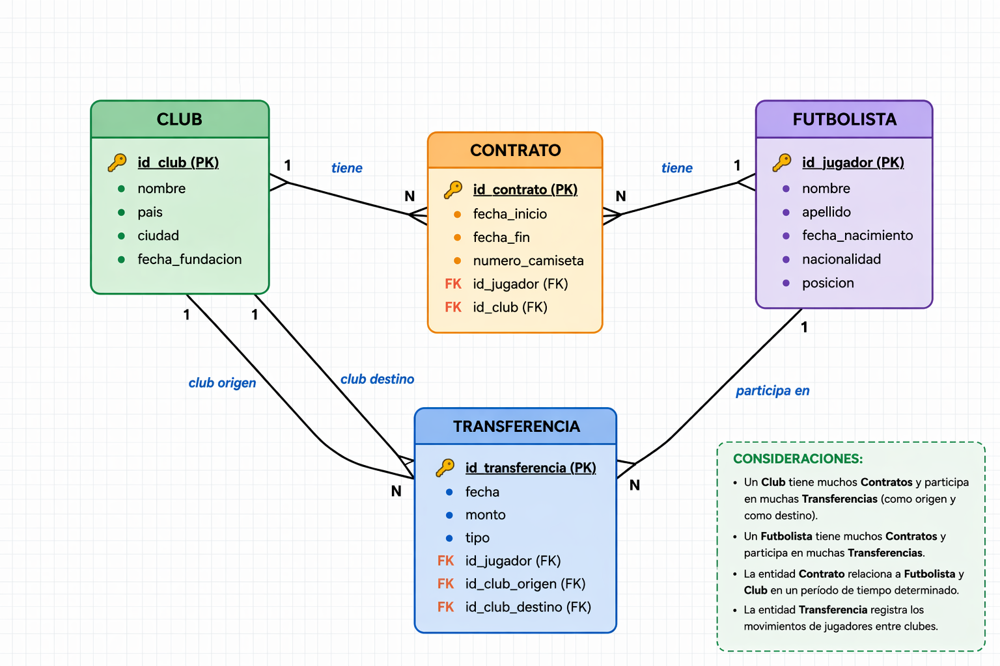

# Web2-TPE
TPE de Web2 (Tadeo y Santiago)
## Integrantes
- Forte Santiago - santiagonforte@gmail.com
- Carrizo Tadeo  - carrizotadeoo@gmail.com

## Temática
Sistema de gestión de fútbol: clubes y futbolistas.

## Descripción
El sistema permite almacenar información sobre clubes de fútbol y jugadores.
Se pueden consultar los futbolistas que pertenecen a cada club y el club actual de cada jugador.

## Modelo de Datos
El modelo está compuesto por las siguientes entidades:

- Club: representa a los equipos de fútbol.
- Futbolista: representa a los jugadores.

## Diagrama Entidad-Relación

## Base de Datos
El script SQL para la creación de la base de datos se encuentra incluido en el repositorio.

- futbol_db.sql
